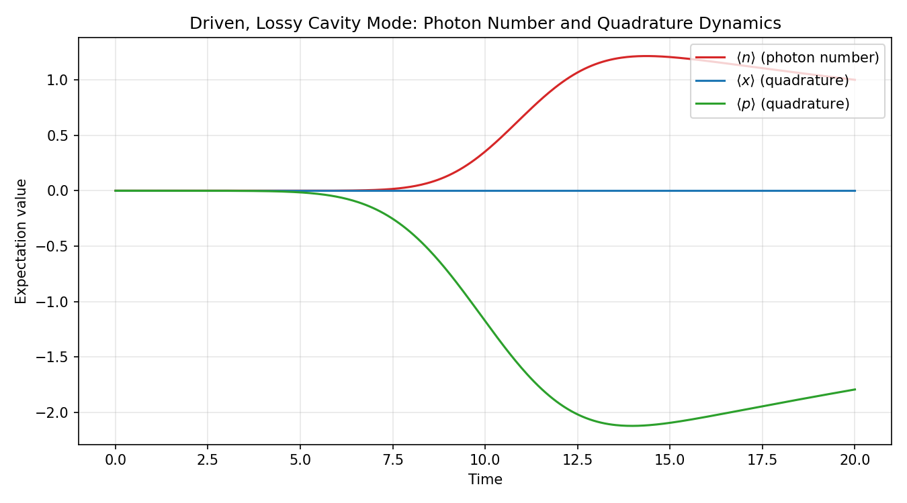

# CavityPulse-QC

### Pulse-Level Quantum Control and Optimization of a Noisy, Driven Cavity Mode

CavityPulse-QC is a compact simulation framework for modeling, optimizing, and visualizing microwave/optical-driven **bosonic mode** dynamics under photon loss and dephasing. It treats control at the **pulse level**: a cavity mode is prepared in vacuum, driven by a shaped microwave/optical envelope, evolved under realistic noise, and the drive is then optimized to maximize the probability of landing in a target Fock state.

---

## Table of Contents

- [Motivation](#motivation)
- [Physics Background](#physics-background)
  - [Driven Bosonic Mode Dynamics](#driven-bosonic-mode-dynamics)
  - [Gaussian Pulse Engineering](#gaussian-pulse-engineering)
  - [Open Quantum Systems](#open-quantum-systems)
  - [Photon Loss and Dephasing](#photon-loss-and-dephasing)
  - [Fidelity](#fidelity)
  - [Phase-Space Observables](#phase-space-observables)
- [Features](#features)
- [Software Stack](#software-stack)
- [Project Structure](#project-structure)
- [Module Breakdown](#module-breakdown)
- [Installation](#installation)
- [Running the Project](#running-the-project)
- [Results and Physical Interpretation](#results-and-physical-interpretation)
- [Critical Assessment](#critical-assessment)
- [Future Extensions](#future-extensions)
- [Requirements](#requirements)

---

## Motivation

A microwave cavity or optical resonator mode is not controlled by an abstract "photon number gate." Physically, population is built up (or removed) by sending a shaped drive tone into the mode, where the drive's **amplitude**, **duration**, and **shape** jointly determine the resulting quantum state.

This turns "prepare a single photon" into a genuine control-engineering problem:

- The drive must build up population in the target Fock state,
- Photon loss and dephasing act continuously throughout the drive, not just afterward,
- And, as this project's results reveal: the *type* of drive itself imposes a hard structural limit on what's reachable, independent of how well any single parameter is tuned.

CavityPulse-QC simulates exactly that workflow computationally. The guiding scenario is simple to state and physically meaningful:

> Start from a cavity mode in vacuum, apply a shaped microwave/optical pulse, evolve the system under realistic photon-loss and dephasing noise, and optimize the control pulse to maximize population transfer into the single-photon Fock state |1⟩.

Everything in the repository: the pulse shape, the noise model, the solver, the optimizer, the diagnostics, and the closed-system reference, exists in service of answering that one question quantitatively, and then explaining *why* the answer comes out the way it does.

---

## Physics Background

### Driven Bosonic Mode Dynamics

A driven single bosonic mode evolves under the Schrödinger equation:

$$i\frac{d}{dt}|\psi(t)\rangle = H(t)|\psi(t)\rangle$$

In the frame rotating at the drive frequency, the Hamiltonian used in this project is:

$$H(t) = \Delta\, a^\dagger a + \frac{\Omega(t)}{2}(a + a^\dagger)$$

where $\Delta = \omega_{\text{cavity}} - \omega_{\text{drive}}$ is the detuning, $a, a^\dagger$ are bosonic ladder operators on a Fock space truncated to `N_LEVELS` levels, and $\Omega(t)$ is the drive envelope.

The current configuration sets $\omega_{\text{cavity}} = \omega_{\text{drive}}$, so $\Delta = 0$. This removes free-evolution drift from the dynamics entirely and isolates the effect of the control pulse and the decoherence channels,  nothing else is competing with the drive for the mode's evolution. That choice keeps the resulting dynamics easy to interpret physically, which matters later when explaining the phase-space trajectories.

### Gaussian Pulse Engineering

The control field is shaped as a Gaussian envelope:

$$\Omega(t) = A\exp\left(-\frac{(t-t_0)^2}{2\sigma^2}\right)$$

where $A$ is the pulse amplitude, $t_0$ is the pulse center, and $\sigma$ controls the pulse width.

The Gaussian shape isn't an arbitrary convenience. Smooth pulses are the standard choice in real microwave/optical cavity control because abrupt waveform discontinuities introduce high-frequency spectral content that can excite unwanted transitions into higher, non-target Fock levels. The bosonic-mode analogue of leakage in a multi-level system. So even this single-parameter pulse already reflects a real hardware-aware control principle: smoother pulses generally produce cleaner dynamics.

### Open Quantum Systems

Real cavity modes are not isolated. They interact with electromagnetic environments, circuit losses, thermal noise, and surrounding control electronics. As a result, photons decay, phase coherence is lost, and state-preparation becomes imperfect even when the control pulse itself is ideal.

The project models these effects with the Lindblad master equation:

$$\dot{\rho} = -i[H,\rho] + \sum_k\left(L_k\rho L_k^\dagger - \frac{1}{2}\{L_k^\dagger L_k, \rho\}\right)$$

where $\rho$ is the density matrix and $L_k$ are collapse operators encoding irreversible interaction with the environment. This formalism matters because pure-state (Schrödinger-equation) evolution alone cannot represent loss or dephasing, the density-matrix framework is what lets coherent dynamics, population transfer, relaxation, and decoherence all be captured simultaneously in one consistent picture.

### Photon Loss and Dephasing

Two standard decoherence channels are included.

**Photon loss** transfers population $|n\rangle \to |n-1\rangle$, with rate $\kappa$ and collapse operator $\sqrt{\kappa}\,a$. This directly competes with the goal of building up population in $|1\rangle$: even if the pulse initially drives the mode upward in photon number, loss continuously pulls population back down throughout the evolution, not just after the pulse ends.

**Photon dephasing** destroys coherences between different Fock components, with rate $\gamma_\phi$ and collapse operator $\sqrt{\gamma_\phi}\, a^\dagger a$, without necessarily changing populations immediately. This weakens the interference effects that accurate state preparation depends on.

### Fidelity

The target state is the single-photon Fock state $|1\rangle$. The simulator evaluates the final-state fidelity:

$$F = \langle 1|\rho_f|1\rangle$$

which measures how successfully the pulse prepared the target state by the end of the evolution. The optimization routine searches for the pulse amplitude that maximizes this quantity.

### Phase-Space Observables

The expectation values $\langle n\rangle$, $\langle x\rangle$, $\langle p\rangle$ describe the driven oscillator's state as it evolves:

$$\langle n\rangle = \langle a^\dagger a\rangle, \qquad \langle x\rangle = \langle a + a^\dagger\rangle, \qquad \langle p\rangle = i\langle a^\dagger - a\rangle$$

Physically, $\langle n\rangle$ tracks photon-number buildup, while $\langle x\rangle$ and $\langle p\rangle$ track the mode's position in phase space: displacement along these quadratures indicates coherent, pulse-driven control, and their behavior over time reveals how coherence and population evolve jointly. Monitoring all three observables gives far more physical insight than looking at the final fidelity alone,  it shows *how* the state got there, not just where it ended up.

---

## Features

- Gaussian pulse engineering
- Time-dependent Hamiltonian simulation on a truncated Fock space
- Lindblad master equation evolution (QuTiP `mesolve`)
- Photon-loss modeling
- Photon-dephasing modeling
- Pulse amplitude optimization (SciPy L-BFGS-B)
- Photon-number and quadrature trajectory visualization
- Ideal closed-system (decoherence-free) reference, built from the same Hamiltonian
- Automatic Fock-space truncation sanity check (leakage warning)
- Modular scientific software architecture

---

## Software Stack

| Library | Purpose |
|---|---|
| QuTiP | Open quantum system simulation |
| NumPy | Numerical computation |
| SciPy | Numerical optimization |
| Matplotlib | Visualization |

---

## Project Structure

```text
CavityPulse-QC/
│
├── README.md
├── requirements.txt
├── main.py
│
├── config/
│   └── system_config.py
│
├── pulses/
│   └── pulse_shapes.py
│
├── noise/
│   └── noise_model.py
│
├── simulation/
│   └── pulse_simulator.py
│
├── optimization/
│   └── optimize_pulse.py
│
├── visualization/
│   └── quadrature_visualization.py
│
├── reference_layer/
│   └── closed_system_reference.py
│
└── results/
    └── quadrature_dynamics.png
```

---

## Module Breakdown

### `config/system_config.py`

Holds all physical and numerical parameters: Fock-space truncation size, drive detuning, photon-loss rate $\kappa$, dephasing rate $\gamma_\phi$, pulse duration, Gaussian width, and simulation resolution. The resonant-drive condition ($\omega_{\text{cavity}} = \omega_{\text{drive}}$) is set here, which is important because it removes unnecessary detuning effects and isolates the control dynamics from the rest of the system.

### `pulses/pulse_shapes.py`

Defines the Gaussian pulse envelope as a standalone function of time. Waveform generation is kept in its own module because pulse shaping is a core abstraction in pulse-level control systems, it is the one piece of the pipeline a hardware engineer would actually redesign first when moving to more advanced pulse families.

### `noise/noise_model.py`

Constructs the Lindblad collapse operators for photon loss and dephasing from $\kappa$ and $\gamma_\phi$. These operators encode irreversible mode-environment interaction; without them the simulation would describe an idealized, lossless cavity rather than a realistic, noisy one.

### `simulation/pulse_simulator.py`

The core simulation engine. Responsible for building the time-dependent Hamiltonian on the truncated Fock space, calling QuTiP's `mesolve` to evolve the Lindblad dynamics, and evaluating the final-state fidelity. This module also performs an automatic **leakage check**: if population in the highest truncated Fock level exceeds $10^{-3}$, it raises a warning that `N_LEVELS` should be increased, since a too-small truncation would silently produce inaccurate dynamics. Every other module either feeds parameters into this one or consumes its output.

### `optimization/optimize_pulse.py`

Uses SciPy's L-BFGS-B to tune the pulse amplitude. This is not simply searching for a bigger number — it is searching for the drive strength that best balances coherent Fock-state buildup against continuous photon loss and dephasing over the fixed pulse duration. The optimization landscape is nontrivial precisely because coherent buildup and decoherence compete throughout the evolution rather than at a single instant.

### `visualization/quadrature_visualization.py`

Plots $\langle n\rangle, \langle x\rangle, \langle p\rangle$ across the full pulse evolution and saves the figure to `results/quadrature_dynamics.png`. This is critical because the phase-space trajectory reveals *how* the state evolves over time, not just whether the final fidelity is high or low.

### `reference_layer/closed_system_reference.py`

Re-evolves the *same* Hamiltonian and *same* pulse with the collapse operators removed ($\kappa = \gamma_\phi = 0$), providing a clean, decoherence-free reference against which the noisy pulse-driven evolution can be compared. Building this reference from the project's own Hamiltonian (rather than an external circuit-model library) isolates the effect of decoherence *exactly*, nothing about the Hamiltonian or pulse shape differs between the two runs. The distinction between ideal, closed-system evolution and realistic, noisy pulse dynamics is one of the central ideas in quantum control, and this module makes that distinction explicit and quantitative.

---

## Installation

### Clone the Repository

```bash
git clone https://github.com/MekhG/CavityPulse-QC.git
cd CavityPulse-QC
```

### Create a Virtual Environment 

**Linux / macOS**

```bash
python -m venv venv
source venv/bin/activate
```

**Windows**

```bash
python -m venv venv
venv\Scripts\activate
```

### Install Dependencies

```bash
pip install -r requirements.txt
```

This installs NumPy, SciPy, Matplotlib, and QuTiP at the versions pinned in `requirements.txt`.

---

## Running the Project

```bash
python main.py
```

The execution pipeline performs, in order:

1. baseline pulse simulation (noisy),
2. pulse amplitude optimization,
3. optimized pulse re-simulation (noisy, with full state tracking),
4. photon-number/quadrature visualization (saved to `results/quadrature_dynamics.png`),
5. ideal closed-system (decoherence-free) reference comparison.

Expected console output:

```text
==================================
 CAVITY-MODE QUANTUM CONTROL SIMULATION
==================================

Baseline fidelity: 0.067988

Optimization Results
------------------------
Optimal amplitude: 0.493737
Optimal fidelity: 0.367789

Quadrature dynamics plot saved to: results/quadrature_dynamics.png

Ideal Closed-System Reference
------------------------
Ideal fidelity (no decoherence, same pulse): 0.331106
Fidelity gap attributable to decoherence: -0.036683
```

> **QuTiP version note:** `simulation/pulse_simulator.py` uses the QuTiP ≥5.0 pythonic time-dependent coefficient signature `f(t, **kwargs)` and passes `c_ops`/`e_ops` as keyword arguments to `mesolve`. If running an older QuTiP 4.x environment, both the coefficient functions and the `mesolve` call will need to be adapted to the legacy `f(t, args)` / positional-argument signature.

---

## Results and Physical Interpretation

The project was executed end-to-end with the current system parameters: $\kappa = 1/25$, $\gamma_\phi = 1/40$, Gaussian width $\sigma = 2$, pulse duration $= 20$, resonant drive ($\Delta = 0$), Fock-space truncation `N_LEVELS = 14`.

```text
Baseline fidelity: 0.067988

Optimization Results
------------------------
Optimal amplitude: 0.493737
Optimal fidelity: 0.367789
```

### Baseline Fidelity Analysis

The initial fidelity, $F \approx 0.07$ at amplitude $A=1.0$, is relatively poor. The original Gaussian pulse overshoots well past a single photon of population before loss and dephasing pull it back down, so very little final population sits specifically in $|1\rangle$. That outcome is physically meaningful rather than a sign of a broken simulator: the pulse must simultaneously build up the right amount of population, avoid overshooting, and compete against decoherence acting throughout the drive. A naive, uncalibrated pulse amplitude rarely succeeds immediately in a realistic control problem — the low baseline fidelity is evidence that calibration matters, which is exactly the premise this project is built to demonstrate.

### Optimization Behavior

After optimization, $F \approx 0.368$ at $A \approx 0.494$, more than five times the baseline. This confirms three things at once: the simulator responds correctly to the control parameter, the control landscape contains real recoverable structure and the L-BFGS-B optimization loop is functioning correctly.

The fidelity still remains well below what a perfect state preparation would require, but that limitation is expected given how constrained the control model is. Only the pulse **amplitude** is optimized, pulse width, center, pulse family, and drive structure are all held fixed. The optimizer is therefore solving a tightly constrained one-parameter control problem, not a fully expressive one, and the result should be read in that light.

### The Central Physical Insight: A Hard Coherent-State Ceiling

The drive term $(\Omega(t)/2)(a + a^\dagger)$ is **linear** in the ladder operators. A linear drive on a harmonic oscillator generates a *displacement* of the vacuum state, it can only ever produce a **coherent state** $|\alpha\rangle$ (up to the small distortions introduced by loss and dephasing), never an exact Fock state.

A coherent state's overlap with the Fock state $|1\rangle$ is:

$$P(1) = |\langle 1|\alpha\rangle|^2 = |\alpha|^2 e^{-|\alpha|^2}$$

which is maximized at $|\alpha|^2 = 1$, giving a hard theoretical ceiling of

$$P(1)_{\max} = \frac{1}{e} \approx 0.367879$$

**The optimizer converged to $F = 0.367789$  within $10^{-4}$ of this exact theoretical bound.** This is not a coincidence: no matter how the single amplitude parameter is tuned, a Gaussian-shaped *linear* drive cannot exceed this ceiling, because the family of states it can reach is restricted to (quasi-)coherent states, and $1/e$ is the maximum any coherent state can achieve against $|1\rangle$. This gives the control model an exact, closed-form fidelity limit, which makes the limitation unusually easy to verify quantitatively rather than just observe empirically.

### Phase-Space (Quadrature) Analysis

<p align="center">
  
</p>

<p align="center"><sub>⟨n⟩, ⟨x⟩, ⟨p⟩ expectation values across the pulse duration, evaluated at the optimized amplitude (A ≈ 0.494).</sub></p>

This trajectory is the most physically informative output of the simulation, it shows *how* the mode got to its final fidelity, not just the number itself.

**Why ⟨x⟩ stays at ≈ 0 throughout.** The drive Hamiltonian is proportional to $(a+a^\dagger)$, i.e. the $x$ quadrature operator itself. A linear drive along $x$ displaces the state purely along $p$ (the canonically conjugate direction), leaving $\langle x\rangle$ essentially unchanged. This is not an uninteresting flat line, it's a sanity check that the Hamiltonian implementation, the drive coupling direction, and the resulting phase-space geometry are all internally consistent with the stated physics.

**Why ⟨p⟩ develops a large, smooth excursion.** As the Gaussian pulse turns on around its center ($t=10$), the mode is coherently displaced along $p$, reaching roughly $-2.1$ near the pulse peak before decay pulls it partway back toward zero afterward. That partial return is physically important in its own right: it is photon loss acting on the displacement generated by the drive, visualized directly rather than inferred from the final fidelity alone.

**Why ⟨n⟩ rises to about 1.2 and settles near 1.0.** $\langle n\rangle = |\alpha(t)|^2$ for a coherent state tracks the squared magnitude of the phase-space displacement. It overshoots slightly above 1 near the pulse's trailing edge, then photon loss brings it back down to settle near $\langle n\rangle \approx 1.0$ by the end of the evolution, consistent with a final state close to a coherent state with $|\alpha|^2 \approx 1$, exactly the point at which $P(1)$ is maximized.

**The synthesis.** The optimizer is not failing numerically,  the control model itself is limited. It successfully finds the best amplitude *within the reachable family of coherent-like states produced by a linear drive*, but a single amplitude parameter cannot escape that family or push past the $1/e$ ceiling that family imposes against a Fock-state target. This is exactly the motivation behind nonlinear and multi-parameter pulse-shaping methods used in real bosonic-mode control, two-photon drives, Kerr-mediated interactions, and measurement-based conditional preparation all exist specifically to address what this minimal model exposes cleanly: a one-parameter linear Gaussian drive hits a hard, interpretable, closed-form fidelity ceiling.

---

## Critical Assessment

The current implementation is intentionally simple, but physically meaningful.

**What it already demonstrates well:**
- pulse-driven bosonic-mode control,
- open-system dynamics in a truncated Fock space,
- decoherence-aware simulation (loss + dephasing),
- fidelity optimization,
- phase-space diagnostics,
- an exact, verifiable theoretical fidelity ceiling for the chosen control model,
- ideal-versus-noisy evolution comparison from a shared Hamiltonian.

**What still limits current performance:**
- the drive is strictly linear in $a, a^\dagger$, which restricts reachable states to (quasi-)coherent states,
- only one control degree of freedom is optimized (amplitude),
- the pulse family is fixed to a single Gaussian,
- no nonlinear (e.g. two-photon, Kerr-mediated) drive terms are included,
- the mode is single-cavity only,
- $\kappa$ and $\gamma_\phi$ are generic rather than hardware-calibrated values.

These limitations are useful as they expose, in closed form, exactly why a linear one-parameter drive cannot exceed $1/e$ fidelity against a Fock state, instead of artificially producing unrealistically high fidelities that wouldn't reflect anything about actual hardware constraints.

---

## Future Extensions

- nonlinear (two-photon / parametric) drive terms to break the coherent-state restriction
- joint optimization over amplitude, width, and detuning
- GRAPE optimal control
- CRAB optimization
- conditional/measurement-based Fock-state preparation
- multi-mode (two-cavity, beamsplitter-coupled) dynamics
- Kerr-nonlinear oscillator modeling instead of a strict harmonic mode
- stochastic noise channels
- Wigner-function visualization alongside quadrature traces
- pulse scheduling
- closed-loop calibration simulation
- Qiskit Dynamics / bosonic-backend integration
- quantum process tomography

---

## Requirements

```text
numpy>=1.24
scipy>=1.10
matplotlib>=3.7
qutip>=5.0
```

---

Project focus: pulse-level quantum control, open quantum systems, bosonic-mode dynamics, coherent-state control limits, numerical optimization.
